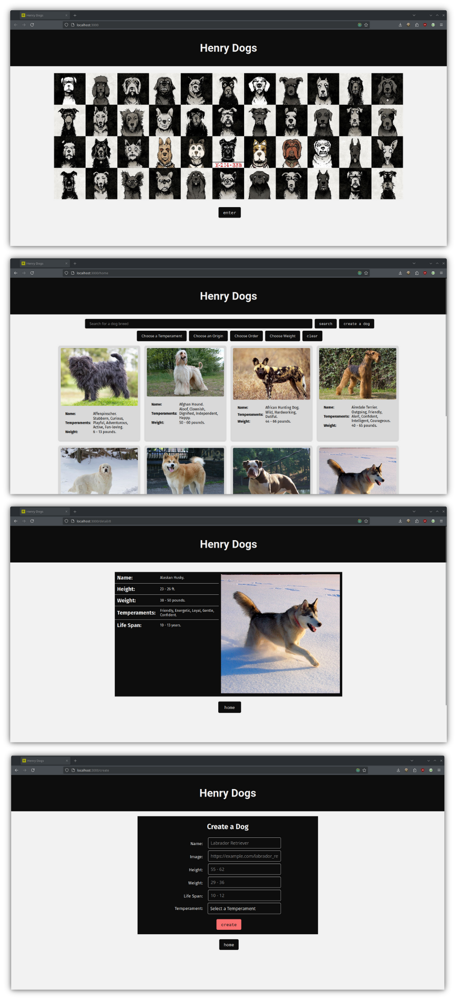

# Henry Dogs App

## Resumen

Henry Dogs es una aplicación web desarrollada como parte de un proyecto individual durante un bootcamp para convertirse en un desarrollador capacitado. El objetivo principal de esta aplicación es conectarse a una API que proporciona información sobre varias razas de perros y mostrarlas en tarjetas fáciles de usar. Además, los usuarios tienen la capacidad de crear nuevos perfiles de perros, que luego se almacenan en la base de datos de la aplicación.

## Características

- **Información de Razas:** Utiliza una API de terceros para obtener información detallada sobre diferentes razas de perros.
- **Mostrar Tarjetas:** Presenta los datos obtenidos en tarjetas visualmente atractivas para facilitar su consumo.
- **Crear Nuevos Perros:** Los usuarios pueden crear y agregar nuevos perros, con la información almacenada en la base de datos de la aplicación.

## Tecnologías Utilizadas

- **React:** 17.0.1
- **React DOM:** 17.0.1
- **React Router DOM:** 5.2.0
- **Redux:** 4.0.5
- **React Redux:** 7.2.3

## Capturas de Pantalla

